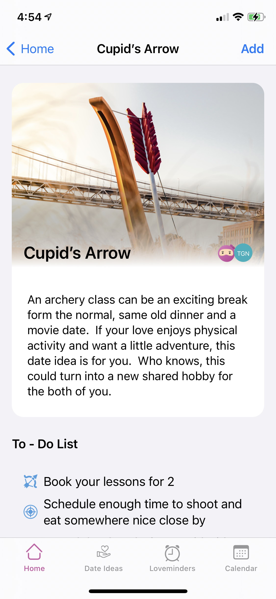
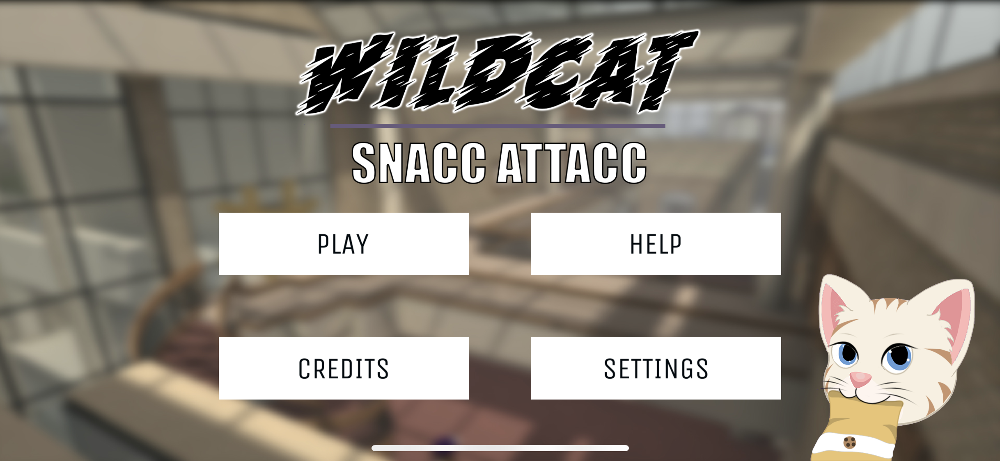

# Hello, World! 👋

<!--
**masterstoney/masterstoney** is a ✨ _special_ ✨ repository because its `README.md` (this file) appears on your GitHub profile.

Here are some ideas to get you started:

- 🔭 I’m currently working on ...
- 🌱 I’m currently learning ...
- 👯 I’m looking to collaborate on ...
- 🤔 I’m looking for help with ...
- 💬 Ask me about ...
- 📫 How to reach me: ...
- 😄 Pronouns: ...
- ⚡ Fun fact: ...
-->

## Welcome to the little corner of the web with all my coding experiments 😬💥

## Tools and Technologies 🔨

## App Store projects 📲

### [LoveMinder by Love on the Fly](https://apps.apple.com/us/app/loveminder-by-love-on-the-fly/id1547058665)
This is a contract project I did for a client. It was built using Swift and it takes advantage of both UIKit and SwiftUI for its user interface. I also built the backend services for the application using nodejs.

  
  
  

### [Snacc Attacc](https://apps.apple.com/us/app/snacc-attacc/id1492507970)
I was responsible for deploying the game on iOS. I also worked on the submission and publishing process for the App Store release.

  
  

## Projects on Github 🚀
